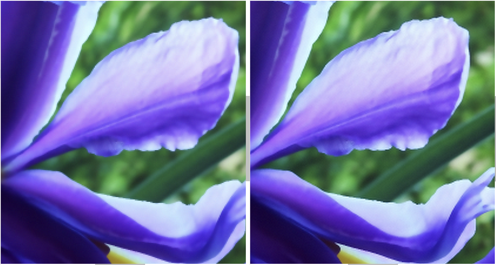

# SISR-sparse-representation
Implementation of "Single Image Super-Resolution via Sparse Representation" by Yang et al. for educational purpose.


## 1. What inside folder `data/`, `dicts/`, and `results`

```
data/
  
│   ├── T91/    # train set 
│   ├── val_hr  # high-resolution val set 
│   │   ├── # Set 5 original
│   ├── val_lr  # low_resolution val set.
│   │   ├── # Set 5corresponding
```

```
dict/
│   ├── # all dictionaries trained (with main.py)
``` 

```
result/ 
│   ├── # the output for inference here
```

> The dataset can be download [here](https://drive.google.com/drive/folders/15PHLMjOuhZdffTkHqqyzWr4UNbDx8axf?usp=sharing)


[`train.py`](train.py): use to train dictionaries

[`main.py`](main.py)  : re-experiment on validation set. 

[`inference.py`](inference.py): test your own image. 

[`utils.py`](utils.py) and [`patches_proc.py`](patches_proc.py): for utils

`proc.py`: pre-preprocessing to generate low-res images (not in use anymore)

## 2. How to run?

2.1 For training dictionaries 

  - You should change the parameters of `TrainConfig()` in [`config.py`]. However, we recommend that the `patch_size` and the `upscale` factor should be 3 and 2, respectively, as mentioned in the paper. 

  - Next, run the following command for training dictionary pairs
  ```python train.py
  ```
  - You should found the trained dictionaries in `dicts/` folder. 

2.2 Evaluating.

  This is the case that you have a pair of high- and low- resolution images and you might want evaluate the functionality of this method. 

  - Firstly, change the parameters of `EvalConfig()` in [`config.py`] for the dictionaries you want to use for reconstruction. 

  - Next, change your path to your image in `main.py`, for example: 
  ```
  params = EvalConfig(hr_img_path= # the high-res image path \
                    lr_img_path= #the low-res image path,\
                    img_name= #name of image (default=None),  \
                    )
  ```
  - Evaluate the method
  ``` 
  python main.py
  ```

  - The result should be stored in `result/` folder.

2.3 Using in real life. 

  This situation is that you have a low-resolution image and want to scale up by a factor, and you have no high-resolution image for comparison. 

  - Change the parameters for dictionaries you use in `TestConfig()` in `config.py`. Then, change the path to your image in `inference.py`. 
  ```
  params = TestConfig(image_path= # the image path
                    )
  ```
  - Your result should be found in `result/` folder. 


## 3. Some results
  
  We test ourselves with an 1020 × 690 image. To upscale the image by a factor of 2, we use a pairs of trained dictionaries with size of 1024 and patch size of 3. The trained dictionary pairs are trained using T91 dataset, containing 91 images of flowers and plants. 

<p align="center">


<p align="center" width="700">Figure. The original 2040 x 1380 flower image.
</p>
</p>


- It takes about ~ 40 minutes to output a 2040 x 1380 high-resolution image. 

- The below image shows a small region of our super-resolution image (on the left) and the original high resolution image (on the right).
   

<p align="center">


<p align="center" width="700">Figure. The comparison in a small region of super-resolution image (on the left) and the high resolution image (on the right).
</p>
</p>

We also provide a comparison with the low-resolution image. To do that, the low-resolution image is zoomed in to the same size with the super-resolution image. 

<p align="center">


<p align="center" width="700">Figure. The comparison in a region of the low-resolution image (zoomed, on the left) and the super-resolution image (on the right).
</p>
</p>
